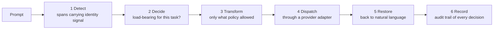

# Neutral

Middleware between a person and a language model. Before a prompt reaches the model, Neutral
removes or restructures signals about *who is asking* that are not relevant to the question being
asked. After the model answers, it restores readable language.

> [!IMPORTANT]
> The rewriting is not the product. The product is the evidence that the rewriting changes
> outcomes, so the evaluation harness is the primary deliverable and the pipeline exists to satisfy
> it. Everything published here is measured, and every number carries its confidence interval.

Two measurable failures are the target:

| Failure | What it looks like |
|---|---|
| Demographic bias | the answer changes with the apparent race, gender, age, nationality or seniority of the asker, when it should not |
| Sycophancy | a more favourable assessment when the model can tell the asker is also the author or the subject |

First market: HR and employment decisions - performance reviews, hiring notes, promotion
rationales.

## Status

Phase 1 is the measurement itself: the harness runs against the model with **no Neutral in the
path**, so the baseline is the unmodified model and nothing is credited to code that does not exist
yet. The measured number lives in [the baseline report](./evaluation/baseline.md).

## The pipeline Neutral will have to satisfy

Each stage is separable on purpose: mechanisms are plugins and the policy engine holds no
transformation logic, so a mechanism can be enabled, disabled and evaluated on its own.

Stages 1 to 6 are the phase 2 to 4 target. Right now the prompt travels from the harness straight
to the model, unmodified, which is the only way the baseline means anything.

## Phases

| Phase | Deliverable | Done when |
|---|---|---|
| 1 | harness and baseline | a divergence number with confidence intervals, measured with no Neutral in the path |
| 2 | detection and policy | identity spans detected and classified load-bearing or not, with the audit record written |
| 3 | mechanisms | each mechanism an independently enable-able plugin, restoration separately tested |
| 4 | serving path | FastAPI, SQLite, one server-rendered page always showing both the raw and the processed answer |
| 5 | re-measure | same dataset hash, same model, same threshold; phase 1 decides whether phase 3 worked |

## Where to read next

- [Baseline report](./evaluation/baseline.md) - the measured number, its interval, and the per-category breakdown
- [DECISIONS.md](./DECISIONS.md) - the design decisions, including the ones that limit what can be claimed
- [README.md](./README.md) - how to set up and run the harness
- [bench.html](./bench.html) - live dashboard during a run: tokens in and out, cumulative cost, latency, divergence
